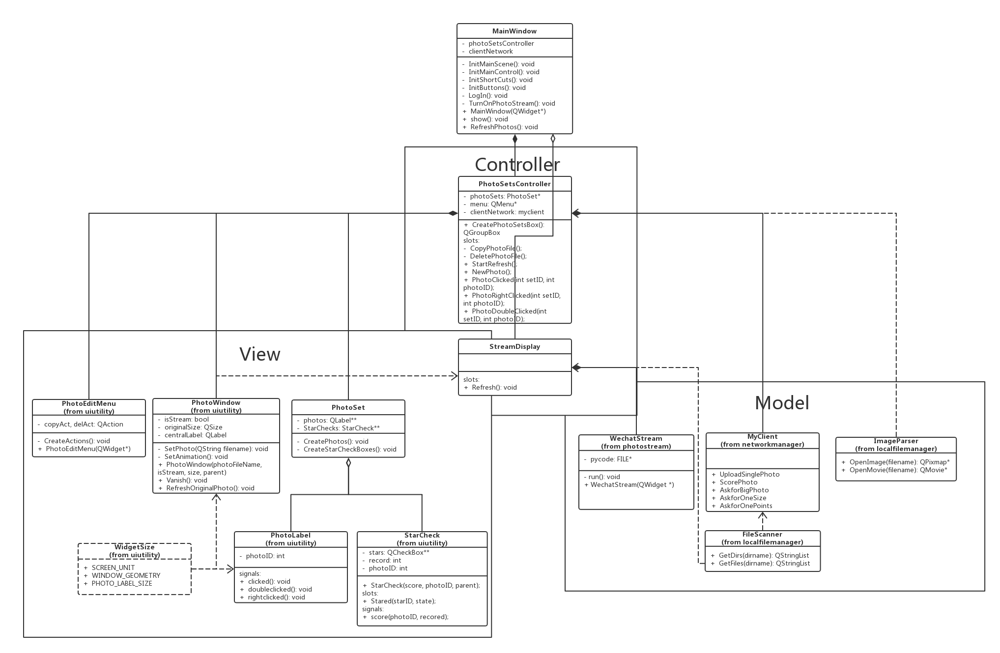

<!--
Created by Qibin Chen on 22/05/2017.
-->

Documentation - Client
================

*   [Overview](#overview)
*   [Classes](#classes)
    *   [MainWindow](#mainwindow)
    *   [PhotoSet](#photoset)
    *   [PhotoSetsController](#photosetscontroller)
*   [Libraries](#libraries)
    *   [PhotoStream](#photostream)
    *   [ClientNetwork](#clientnetwork)
    *   [UiUtility](#uiutility)
    *   [LocalFileManager](#localfilemanager)

---

<h2 id="overview">Overview</h2>

*   This is the desktop version of Facemash2_client.
*   Package diagram

*   Class diagram


---

<h2 id="classes">Classes</h2>


<h3 id="mainwindow">MainWindow</h3>

##### Abstract

*   The Main VIEW of the ui.

##### private:

*   InitMainScene
    *   ```c++
        void InitMainScene();
        ```
    *   Initialize the main layout.
    *   Includes photoArea, albumArea, photoSetsController, albumController.
    

*   RefreshAlbums
    *   ```c++
        void RefreshAlbums();
        ```
    *   Refresh the display of albums.
    *   Should be called when albums have changed.
    *   The task is delegated to albumController. And it will return a new albumBox, which albumArea set as its display widget.

*   RefreshPhotos
    *   ```c++
        void RefreshPhotos();
        ```
    *   Refresh the display of photo sets.
    *   Should be called when photos have changed or the view(ex: number of photos per row) has changed.
    *   Similarly, the task is delegated to a photoSetsController. It returns a QGroupBox of PhotoSets, which are QGroupBoxes of PhotoLabels themselves.

##### public:

*   MainWindow
    *   ```c++
        MainWindow(QWidget *parent = nullptr);
        ```
    *   Constructor of the main window.
    *   Window properties such as title, menu, main layout should be initialized here.
    

<h3 id="photoset">PhotoSet</h3>

##### Abstract

*   This is the VIEW of a photo set, derived from QGroupBox.

##### public:

*   PhotoSet
    *   ```c++
        PhotoSet(int setID, const int fileNum, const QString fileList[], const QString &title, QWidget *parent = nullptr);
        
        setID       -   ID of this set.
        fileNum     -   number of photo files in this set.
        fileList    -   file list.
                        ex: ["set1/image1.jpg", "set1/image2.jpg"]
        title       -   title of the GroupBox.
                        ex: "photoset1" / "yesterday" / "starred".
        ```

##### public slots:

*   PhotoClicked
    *   ```c++
        void PhotoClicked(int i);
        
        void PhotoRightClicked(int i);
        
        void PhotoDoubleClicked(int i);
        ```
    *   These slots accept click signals from all photo labels that the photo set contains.

##### signals:

*   photoClicked
    *   ```c++
        void photoClicked(int setID, int photoID);
        
        void photoDoubleClicked(int setID, int photoID);
        
        void photoRightClicked(int setID, int photoID);
        ```
    *   As the slots above collect all the signals from the set's photos, these signals are emitted meanwhile.
    *   These signals will be passed to a photoSetsController who takes action.


<h3 id="photosetscontroller">PhotoSetsController</h3>

##### private:

*   photoSets
    *   ```c++
        PhotoSet **photoSets;
        ```
    *   Pointers to the photoSets which it currently controls.
    *   The controller has slots which receive the clicked signals from them.

##### public:

*   CreatePhotoSetsBox
	*   ```c++
        QGroupBox *CreatePhotoSetsBox();
        ```
    *   Creates a QGroupBox of PhotoSets, which are QGroupBoxes of PhotoLabels themselves.

---

<h2 id="libraries">Libraries</h2>

* <a id="photostream" href="../libs/photostream/docs/photostream.md" title="PhotoStream Documentation">PhotoStream</a>

* <a id="clientnetwork" href="../libs/clientnetwork/docs/clientnetwork.md" title="ClientNetwork Documentation">ClientNetwork</a>

* <a id="uiutility" href="../libs/uiutility/docs/uiutility.md" title="UiUtility Documentation">UiUtility</a>

* <a id="localfilemanager" href="../libs/localfilemanager/docs/localfilemanager.md" title="LocalFileManager Documentation">LocalFileManager</a>
