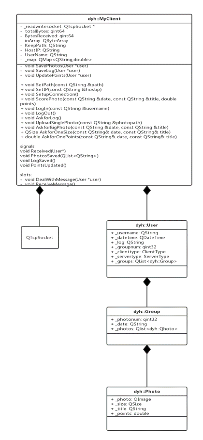
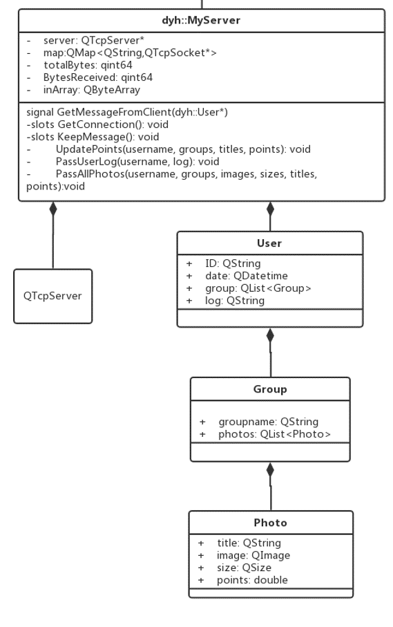

# 数据传输-Documentation

[TOC]

​       客户端与服务器之间传输的信息会根据操作种类的不同而发生变化，考虑到这一点，为了规范统一传输数据的格式，实现了传输数据类User，声明在data.h文件中。进行不同的操作时，传输的有用数据为传输数据类的一个子集，数据类的其余部分内容为空，即不需要这部分信息。又考虑到客户端与服务器的需求，为了方便对数据进行处理，采取了组合的设计模式，最终实现的User类实际是三层结构嵌套的结果。传输数据类的成员权限设置为公有，可方便地进行修改或添加。传输数据类的详细结构见下说明。

## UML类图

### MyClient



### MyServer



## Photo

##### Introduction

Photo类代表单张照片，包含了照片数据本身、照片的名称、照片的尺寸（通过照片尺寸可判断照片为原始图片还是缩略图片）以及评分。

##### Data Members

```c++
QImage _photo;
QString _title;
QSize _size;
double _points;
```
##### Methods

```c++
QDataStream &operator<<(QDataStream & out, const Photo& photo)
{
    out<<photo._photo;
    out<<photo._title;
    out<<photo._size;
    out<<photo._points;
    return out;
}
```

```C++
QDataStream &operator>>(QDataStream& in, Photo& photo)
{
    in>>photo._photo;
    in>>photo._title;
    in>>photo._size;
    in>>photo._points;
    return in;
}
```

为了方便自定义类的写入和读取，为其重载了流运算符。

## Group

##### Introduction

Group类代表一组照片，记录了这组照片上传的日期（以日期分组）和这组照片的数量。

##### Data Members

```c++
QString _date;
qint32 _photonum;
QList<Photo> _photos;  //一组Photo对象构成的列表
```
##### Methods

同样为其重载了流运算符。

## User

##### Introduction

User类代表客户端或服务器的一次操作，记录了客户端或服务器操作的种类，并包含与这些不同操作有关的信息。

##### Data Members

```C++
QString _username;  //用户名
QDateTime _datetime;  //操作的日期时间
ClientType _clienttype;  //客户端操作种类
ServerType _servertype;  //服务器操作种类
QList<Group> _groups;  //照片（以Group的形式）
qint32 _groupnum;  //照片总数
QString _log;  //用户操作日志
```

##### Methods

同样为其重载了流运算符。

------


# 客户端通信

​       客户端构建MyClient类实现与服务器端的数据发送与接收。MyClient类封装了Qt内置的QTcpSocket类，在其基础上进行扩展，提供了支持用户多种不同操作的接口。下面以MyClient的不同功能展开，对客户端通信进行较为详细的介绍。

## 初始化

### Interfaces

```c++
public:
	void SetPath(const QString &path);  //设置保存路径
	void SetIP(const QString &hostip);  //设置所要连接的IP地址
public slots:
    void SetupConnection();  //建立连接
```
### Details

​        MyClient类里记录了所要连接的主机的IP地址，以及服务器传输来的数据的保存路径，通过与初始化有关的接口可以对记录这些信息的变量进行赋值。将SetupConnection函数设置为公有槽函数可以方便地与本地客户端进行信号-槽机制的连接。

```C++
QObject::connect(_readwritesocket, SIGNAL(readyRead()), this, SLOT(ReceiveMessage()));
QObject::connect(this, SIGNAL(Received(User*)), this, SLOT(DealWithMessage(User*)));
```

​       在SetupConnection函数内部，向主机发送完连接请求后，将数据到来的信号与MyClient的数据接受与处理函数通过信号-槽机制连接起来。

## 接收数据（无阻塞方式）

### Data Members

```C++
private:
	qint64 totalBytes;  //总字节数
	qint64 BytesReceived;  //已接收字节数
	QByteArray inArray  //输入缓冲
```

### Methods

```c++
private slots:
    void DealWithMessage(User *user);
    void ReceiveMessage();
signals:
	void Received(User*);
```
### Details

​       服务器端发送的数据到来后，会触发readyread信号，与该信号相连的ReceiveMessage槽函数负责接收数据。当传输数据量较大时，可能会超过QTcpSocket自身的缓冲区容量限制，于是我们在MyClient内部定义缓冲区变量，分批次地接收发送来的数据。又考虑到若干个数据包不会一次同时到来，无法判断何时接收完毕，我们在客户端与服务器之间进行约定，在待发数据之前插入64Bit用于表示待发送数据的总规模。这一64位整数被读入totalBytes变量中：

```C++
if(totalBytes == 0 && _readwritesocket->bytesAvailable() >= sizeof(qint64))
{
    QDataStream in(_readwritesocket);
    in.setVersion(QDataStream::Qt_4_6);
    in>>totalBytes;
}
```

​       用变量BytesReceived记录已经接收的字节数，每当readyread信号被触发，即有可用数据时，便把数据读入，同时对BytesReceived进行更新。当已接收字节数与总字节数相等时，即代表一次发送的数据全部接收完成，这时发送Received信号将数据移至槽函数DealwithMessage进行处理，同时将totalBytes与BytesReceived归零。

```C++
if(BytesReceived < totalBytes)
{
    BytesReceived += _readwritesocket->bytesAvailable();
	....
	if(BytesReceived == totalBytes)
    {
        totalBytes = 0;
        BytesReceived = 0;
        QDataStream in(&inArray, QIODevice::ReadOnly);
        in.setVersion(QDataStream::Qt_4_6);
        User *_user = new User;
        in>>(*_user);
        inArray.resize(0);
        emit Received(_user);
    }
	....
```

​       在DealwithMessage函数内，通过switch语句对服务器端的不同操作类型，交由不同的函数进行处理。

## 数据存储

### Methods

```C++
signals:
	void PhotosSaved(QStringList);
    void LogSaved();
    void PointsUpdated();
private:
	void SavePhotos(User *user);
	void SaveLog(User *user);
	void UpdatePoints(User *user); //更新分数
```

### Details

​       以上三个私有函数分别对应于服务器端的三类操作，在本地客户端完成存储照片、存储用户操作日志以及更新照片分数的功能（存储路径由MyClient的数据成员KeepPath指定）。以上的三个信号则分别在数据存储完成后发出，向MyClient类的上级报告可以使用。其中PhotosSaved信号携带的参数为刚保存完毕的照片的路径列表。

​       在SaveLog函数中有：

```C++
void MyClient::SaveLog(User * user)
{
    qDebug() << "ClientNetwork::SaveLog";
    QFile *logfile = new QFile(KeepPath + "Log.txt");
    if (!logfile->open(QFile::WriteOnly))
    {
        qDebug() << "Open LogFile Error!";
        return;
    }
    logfile->write(user->_log.toLatin1());
    logfile->close();

    emit LogSaved();
}
```

​	SavePhotos函数中的情形与之类似，对照片按照名称以及所属的组名分组保存。

​	照片的评分保存在Json格式的配置文件中，除此之外，配置文件还包含照片的名称、分组情况、照片的尺寸大小等信息。UpdatePoints函数对配置文件进行更新，SavePhotos函数在将照片保存后也将对配置文件进行更新。

## 本地配置文件

​	本地配置文件为Json格式，利用了Qt内置的QJsonObject类以及QJsonDocument类，需要更新时，将配置文件读入并转换为QJsonObject，更改完毕后再写回。如在SavePhotos函数内：

```C++
QByteArray JsonArray = file->readAll();
QJsonDocument doc = QJsonDocument::fromJson(JsonArray);
QJsonObject object = doc.object();
...
		inobj2.insert("points", user->_groups.at(i)._photos.at(j)._points);
		inobj2.insert("width", user->_groups.at(i)._photos.at(j)._size.width());
		inobj2.insert("height", user->_groups.at(i)._photos.at(j)._size.height());
		...
```

## 用户登入与登出

### Data Members

```
QString UserName;
```

### Interfaces

```C++
public:
	void LogIn(const QString &username);
	void LogOut();
```

### Details

​        UserName为MyClient类的数据成员，记录用户名，在第一次登陆时被赋值，此后客户端每次操作所发送的数据中都含有该用户的用户名，用于标明身份。

​        LogIn函数用于用户登录，用户登陆时，LogIn函数首先会检查本地的配置文件，将配置文件中的信息按照User类的组织形式存放在一个构建好的User对象中，若本地无配置文件，则自动创建配置文件，构建的User对象为空对象。这样做的目的是考虑到服务器端与客户端的照片数据并不相同，于是将配置文件发送到服务器端进行比对，由服务器端将本地没有的照片返回，这样可以使用户登陆后自动与服务器完成同步。

​	下面以LogIn函数为例说明客户端如何向服务器端发送数据：

```C++
/******已构建好User对象*********/
QByteArray BtArray;
QDataStream out(&BtArray, QIODevice::WriteOnly);
out.setVersion(QDataStream::Qt_4_6);
out<<(qint64)0;
out<<user;
out.device()->seek(0);
out<<(qint64)(BtArray.size() - sizeof(qint64));
_readwritesocket->write(BtArray);
_readwritesocket->waitForBytesWritten();
```

​        之前已经提到过，我们约定在待发数据之前插入64位整数表示待发送数据的总规模。然而，我们事先并不知道待发送的数据总量。这里采用了一个小技巧，先用64位的整数0占位，将待发送数据安排好后，再计算其大小并替代先前占位的0。这里采用阻塞方式的waitForBytesWritten可以确保数据被写入Socket。

​	LogOut函数用于用户登出，其发送数据的方式与LogIn类似。在发送数据完毕后，LogOut函数向主机请求断开连接，这里同样采用了阻塞方式：

```C++
_readwritesocket->disconnectFromHost();
if(_readwritesocket->state() == QAbstractSocket::UnconnectedState ||
    _readwritesocket->waitForDisconnected(2000))
    qDebug()<<"Disconnected";
```

## 其他与服务器端的交互操作

### Interfaces

```C++
public:	
	void AskforLog();  //请求操作日志
	void UploadSinglePhoto(const QString &photopath);  //上传单张照片
    void AskforBigPhoto(const QString &date, const QString &title);  //请求大图
	void ScorePhoto(const QString &date, const QString &title, double points);  //为照片评分
```

	### Details

​	这些操作的发送数据的方式与上面提到过的LogIn函数类似，其中UploadSinglePhoto函数与ScorePhoto函数在发送数据完毕后还会更新本地的相册以及本地的配置文件。AskforBigPhoto函数用于请求大图。为了提高数据传输的速度、节省内存以及本地存储空间，服务器端开始时向客户端传输的照片均为缩略图，只有在客户端点击某一照片想要细致观看时，客户端才向服务器端发出请求并展现原图。这样可以使整个程序运行得更加高效。对应于每一客户端操作，都定义了枚举量来表示。

```C++
enum ClientType
{
	DEFAULTc, LOGIN, LOGOUT, FORBIG, ADD, EVAL, FORLOG
};    //用户的操作种类
enum ServerType
{
	DEFAULTs, PHOTOS, LOG, POINTS
};    //服务器的操作种类
```

## 查询

### Interfaces

```C++
public:
    QSize AskforOneSize(const QString& date, const QString& title);
    int AskforOnePoints(const QString& date, const QString& title);
```

### Details

​	客户端有时需要查询照片的尺寸、分数等信息，因此也提供了相应的查询接口。注意到这种查询操作是很频繁的，不能每次操作都从配置文件中获得信息，于是我们利用了Qt内置的QMap类，以支持高效的查询操作。QMap对象的更新与配置文件的更新是保持一致的。例如，对于AskforOnePoints函数而言，只需：

```C++
return (int) _map.value(date + title);
```

其中_map是QMap<QString,double>类对象。

------


# 服务器端通信

​	服务器端构建MyServer类实现与客户端的数据发送与接收。MyServer类在封装了QTcpServer和QTcpSocket的基础上扩展而成，提供了如下的发送数据的接口：

```C++
public:	
	void PassAllPhotos(const QString& username, qint32 groupnum, const QList<qint32>& photonums, const QList<QString>& dates,const QList<QImage>& images, const QList<QSize>& sizes, const QList<QString>& titles,const QList<double>& points);   //传照片（可单张也可多张）
	void PassUserLog(const QString& username, const QString& log);  //传用户日志
	void UpdatePoints(const QString& username, qint32 groupnum, const QList<qint32>& photonums, const QList<QString>& dates,const QList<QString>& titles, const QList<double>& points);//更新分数
```

​	这些接口的数据发送方式与客户端类似，在此不再赘述。下面详细说明服务器端如何支持与多个客户端通信。

### Data Members

```C++
QMap<QString,QTcpSocket*> _map;
```

### Methods

```C++
private slots:	
	void GetConnection();
	void KeepMessage();
```

	### Details

​	_map变量是一个在QString类对象和QTcpSocket对象指针之间的一个映射，实现了用户名与QTcpSocket地址之间的一一对应。在GetConnection函数中，每有一个新连接到来，就创建一个QTcpSocket对象，将其readyRead信号与槽函数KeepMessage连接起来，并令其断开连接后自动析构（此时并未加入到映射中，因为不知道用户名）：

```C++
QObject::connect(_socket, SIGNAL(readyRead()), this, SLOT(KeepMessage()));
QObject::connect(_socket, SIGNAL(disconnected()), _socket, SLOT(deleteLater()));
```

​	KeepMessage函数和多个readyRead信号相连，因此需要通过sender()函数来返回发送信号的Socket对象，这时通过数据中包含的用户名信息，就可以在用户名与这个Socket对象之间建立映射关系。

```C++
QTcpSocket *socket = qobject_cast<QTcpSocket*>(sender());
...
		if(user->_clienttype == LOGIN)
         {
             if(_map.contains(user->_username))
             {
                 qDebug()<<"UserName Existed!";  //用户名已存在
                 socket->disconnectFromHost();  //则断开连接
                 socket->waitForDisconnected();
                 delete user;
             }
             else
             {
                 _map.insert(user->_username,socket);
                 emit GetMessageFromClient(user);
             }
         }
		...
```

​	发送数据时，MyServer根据后台给出的用户名，将数据发往与之对应的Socket。

```c++
QTcpSocket *socket = _map.value(username);
```

​	用户登出时，将其从_map中删除（此时Socket断开连接自动析构）。

```C++
else if(user->_clienttype == LOGOUT)
{
     socket->disconnectFromHost();
     socket->waitForDisconnected();
     _map.remove(user->_username);
     ...
```